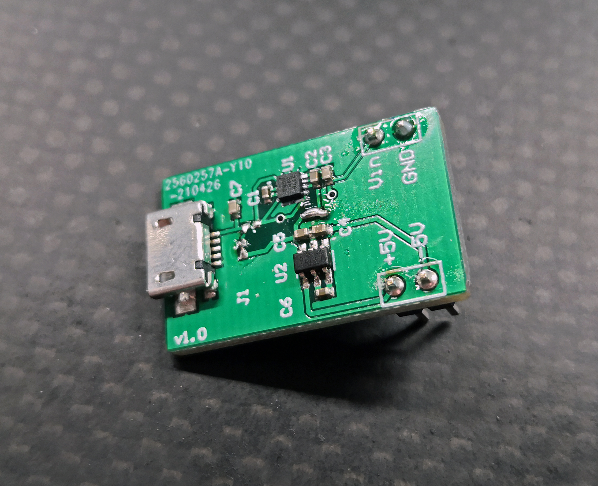

# OpAmp-Inverting-PSU
Cheap breadboard friendly PCB to provide regulated +-5V from a micro USB.

The project is created in colaboration with NTNU, for use in a introduction course to electronics. 

It utilizes a TI LM2775 to first regulate the USB input voltage to a regulated 5V and then a LM2776 to invert the voltage to -5V. 
The ICs are rated for 200mA and have built in short circuit protection.

All parts are sorted from JLC PCB in order to keep production assembly cost at a minimum.

Know faults: 
Inverter does not work if -5V is pulled high by a resistor. This can be fixed with a FV diode.

